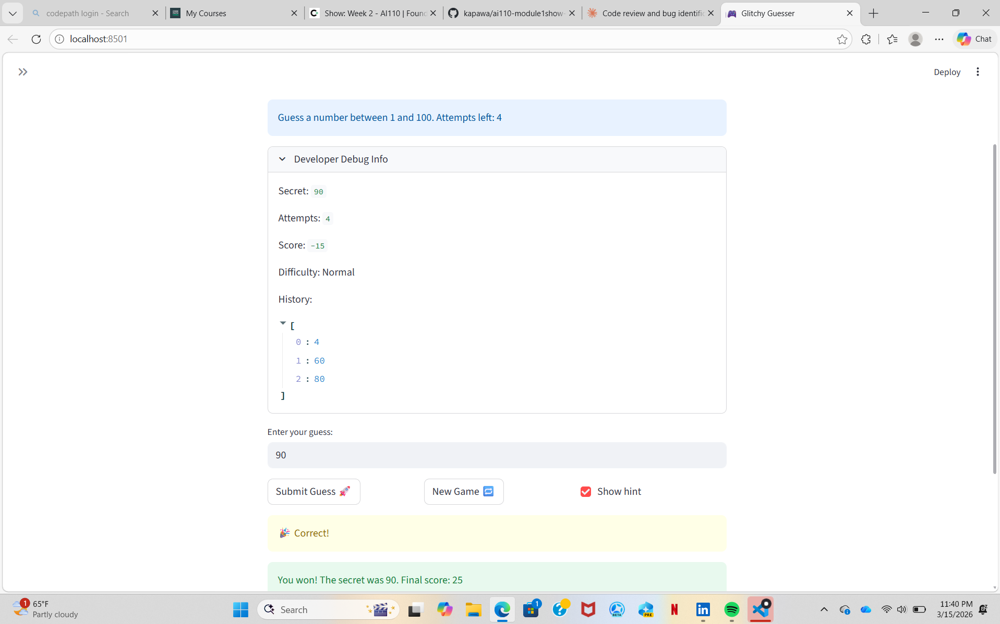

# 🎮 Game Glitch Investigator: The Impossible Guesser

## 🚨 The Situation

You asked an AI to build a simple "Number Guessing Game" using Streamlit.
It wrote the code, ran away, and now the game is unplayable. 

- You can't win.
- The hints lie to you.
- The secret number seems to have commitment issues.

## 🛠️ Setup

1. Install dependencies: `pip install -r requirements.txt`
2. Run the broken app: `python -m streamlit run app.py`

## 🕵️‍♂️ Your Mission

1. **Play the game.** Open the "Developer Debug Info" tab in the app to see the secret number. Try to win.
2. **Find the State Bug.** Why does the secret number change every time you click "Submit"? Ask ChatGPT: *"How do I keep a variable from resetting in Streamlit when I click a button?"*
3. **Fix the Logic.** The hints ("Higher/Lower") are wrong. Fix them.
4. **Refactor & Test.** - Move the logic into `logic_utils.py`.
   - Run `pytest` in your terminal.
   - Keep fixing until all tests pass!

## 📝 Document Your Experience

- [ ] Describe the game's purpose. 
This game is a Streamlit number-guessing challenge where the player chooses a difficulty, tries to guess a hidden number within limited attempts, and gets directional hints plus score updates after each guess.
- [ ] Detail which bugs you found.Hint direction bug: when a guess was too high, the game told the player to go higher, and vice versa. Difficulty inconsistency: Hard had fewer attempts but a narrower range than Normal, which made the difficulty design contradictory.Attempts counter bug (identified): attempts start/count logic is off by one, so the game can report out-of-attempts earlier than expected.
- [ ] Explain what fixes you applied.Refactored shared game logic into logic_utils.py and imported it into app.py. Corrected hint messages so:
Too High -> Go LOWER
Too Low -> Go HIGHER. Corrected difficulty scaling so Hard uses a wider range than Normal. Added #FIX comments at change points as requested. Updated tests to validate both outcome labels and hint text directions.

## 📸 Demo

- [ ] [Insert a screenshot of your fixed, winning game here]

## 🚀 Stretch Features

- [ ] [If you choose to complete Challenge 4, insert a screenshot of your Enhanced Game UI here]
